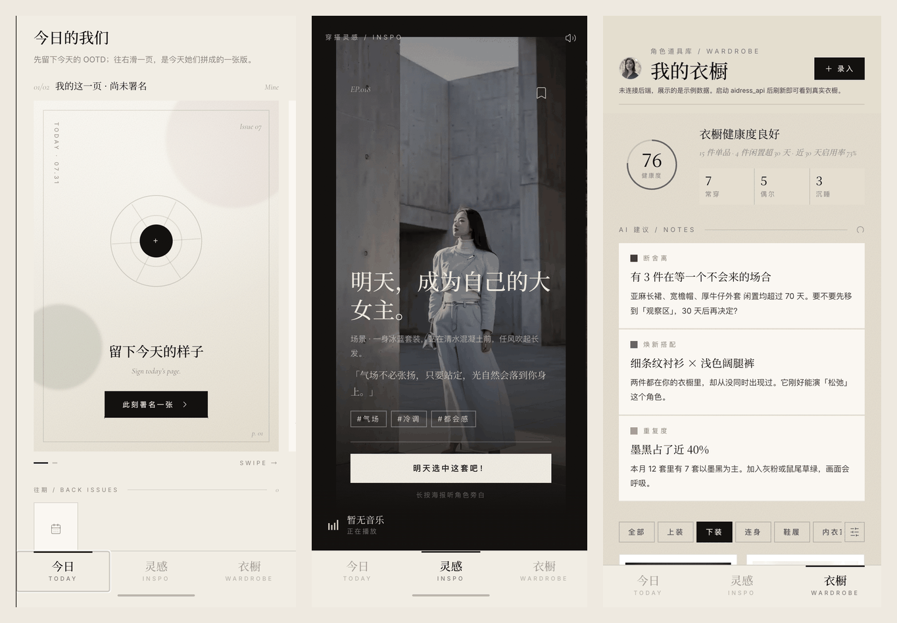

# WearWise AI

> Don't conform — wear your own story.

An emotion-driven AI wardrobe & outfit assistant that understands your closet, senses your mood, generates personalized outfit recommendations, and turns your daily OOTD into a meaningful diary.

🏆 This project was built for the Xiaohongshu (RED) internal Hackathon.

**[中文文档](./README.md)** | English


<p align="center"><em>Today · Inspiration · Closet</em></p>

---

## Overview

**WearWise AI (有一套)** is a full-stack AI-powered wardrobe and outfit assistant. Instead of only "matching clothes", it focuses on **emotional value**: it senses how you feel today, understands what's already in your closet, and generates outfit suggestions that tell your story.

Core value propositions:

1. **Mood understanding** — combines schedule, weather, today's OOTD, a "flower-picking" mini game and historical feedback to infer the user's current emotional needs.
2. **Smart closet** — multi-modal AI recognizes category, color and silhouette from a photo, auto-completes a clean product-style image, and builds a searchable wardrobe inventory.
3. **Personalized styling** — generates and ranks outfit candidates based on body profile, dressing habits, current mood and past feedback.
4. **Emotional diary** — every "signed" daily photo is read by AI to produce a short, warm emotional-value note, forming an OOTD diary over time.

## Tech Stack

| Layer | Technologies |
|---|---|
| Backend | Python, FastAPI, Uvicorn |
| Database | PostgreSQL (structured data in JSONB + binary assets via Large Objects) |
| AI Gateway | Runway enterprise AI gateway — Anthropic-compatible Messages API (text/vision) & Google GenerateContent-compatible API (image generation) |
| Frontend | React 18, TypeScript, Vite |
| UI | Tailwind CSS, Radix UI, MUI icons, shadcn/ui-style components |
| Animation | Motion (Framer Motion family) |
| Tooling | npm / pnpm workspace |

## Project Structure

```
aidress/
├── backend/                 # FastAPI service
│   ├── app.py                # API routes, SSO auth, static hosting for frontend dist
│   ├── store.py               # PostgreSQL persistence (JSONB tables + Large Objects for binaries)
│   ├── ai.py                  # AI gateway client (text/vision + image generation)
│   ├── intake.py               # Closet item intake: photo -> background cleanup -> tagging
│   ├── insights.py             # Closet analytics & AI-generated insight cards
│   ├── emotion.py              # Flower game -> mood analysis -> outfit recommendation
│   ├── ootd.py                 # Daily "signed" photo -> AI emotional-value diary entry
│   ├── avatar.py               # Reference photos + profile -> full-body avatar generation
│   ├── init_db.py              # DB schema creation + seed data loading
│   ├── requirements.txt
│   ├── assets/                 # Baseline model images for avatar generation
│   └── prompts/                # Prompt templates (tagging, background completion, avatar)
├── frontend/                 # React + Vite SPA
│   └── src/app/
│       ├── components/          # TodayTab, ClosetTab, PrescriptionTab, AuditionFlow, ui/ ...
│       └── lib/                 # api client, global store, weather hook, content constants
├── seed_data/                # Seed data for closet items, looks catalog, OOTD diary, music, etc.
├── data_export/               # Database export snapshot
├── install.sh                # Install dependencies + init DB + load seed data
├── start.sh                   # Start the FastAPI app (serves API + built frontend)
├── health.sh                  # Health check script
└── prepack.sh                 # Pre-packaging: rebuild frontend dist when needed
```

## Core Features

- **Closet management** (`/api/closet`, `/api/closet/intake`) — list/filter/sort items, upload & auto-tag new items, delete items.
- **Closet insights** (`/api/closet/insights`) — usage rate, idle-item detection, color-diversity suggestions, wardrobe health score; recalculated automatically every day at midnight.
- **Mood-based recommendation** (`/api/emotion/recommend`) — flower-picking mini game feeds an LLM to infer mood, then recommends outfit styles from a curated catalog with reasons.
- **OOTD diary** (`/api/ootd/sign`, `/api/ootd/diary`) — upload today's outfit/selfie photo, AI reads the image and writes a short emotional-value note (headline, 2-word summary, keywords, a short signature).
- **Avatar generation** (`/api/profile/avatar`) — combine reference photos with body profile (height/weight/age/etc.) to generate a full-body styled avatar image.
- **SSO-protected APIs** — all business routes require an authenticated user injected by the platform.

## Getting Started

**One-click deployment (target environment with `db.properties` / `ai.properties` already provisioned):**

```bash
bash install.sh   # install dependencies, init DB schema, load seed data
bash start.sh     # start the app (default: http://127.0.0.1:3000, configurable via $APP_PORT)
bash health.sh    # health check (used by the deploy platform)
```

**Local development:**

```bash
# Backend (http://127.0.0.1:8100)
cd backend
pip install -r requirements.txt
python3 -m uvicorn app:app --reload --port 8100

# Frontend (http://localhost:5173, proxies /api,/img,/avatar,/ootd to :8100)
cd frontend
npm install
npm run dev
```

## Configuration

> ⚠️ **No credentials are committed to this repository.** The files below are listed in `.gitignore` and must be created locally / injected by the deployment platform.

| File / Variable | Purpose |
|---|---|
| `db.properties` | PostgreSQL connection info (`db.host`, `db.port`, `db.database`, `db.username`, `db.password`) |
| `ai.properties` | AI gateway endpoint & credential (`ai.base_url`, `ai.api_key`) |
| `APP_PORT` | Backend listening port (default `3000`) |

If these are not configured, related API endpoints respond with `503` instead of failing silently.

## Data Model (PostgreSQL)

| Table | Purpose |
|---|---|
| `closet_items` | Wardrobe items — tags (JSONB), wear count, idle days, status, image reference |
| `profile` | User profile — name, height, weight, age, gender, notes, avatar URL |
| `ootd_diary` | Daily diary entries keyed by date |
| `insights_cache` | Cached wardrobe insight cards, refreshed daily |
| `files` | Binary asset index backed by PostgreSQL Large Objects (photos, avatars, generated images) |
